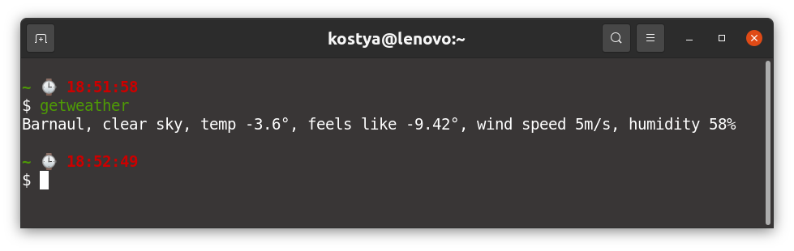

# custom-weather-receiver

## General info

This is a simple application to get a weather forecast for my hometown.

For these purposes I have used [https://openweathermap.org/](https://openweathermap.org/)

## How I use it

